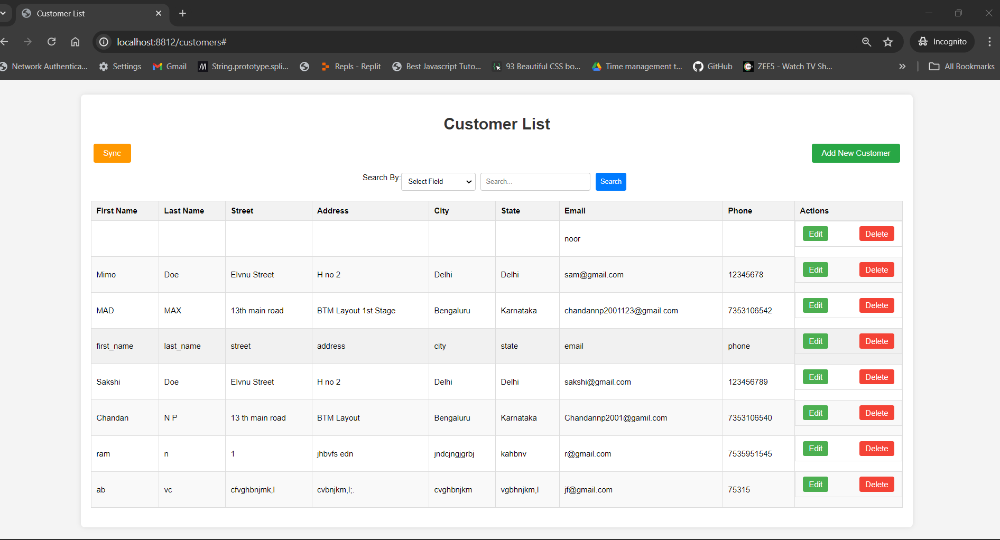
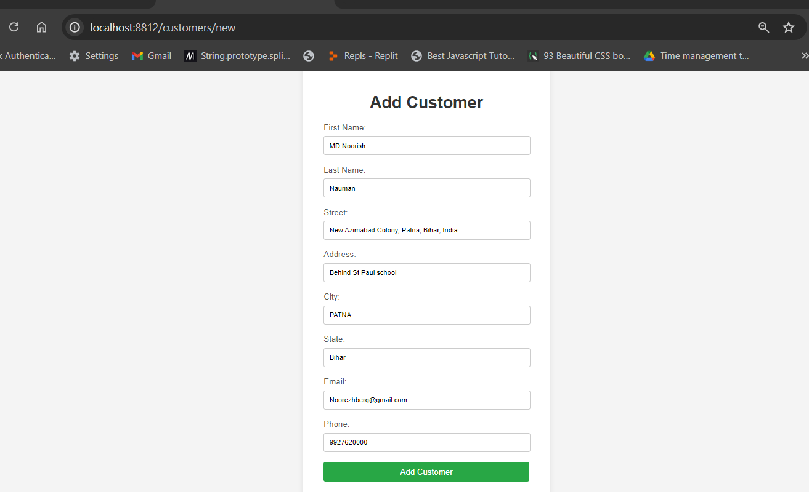
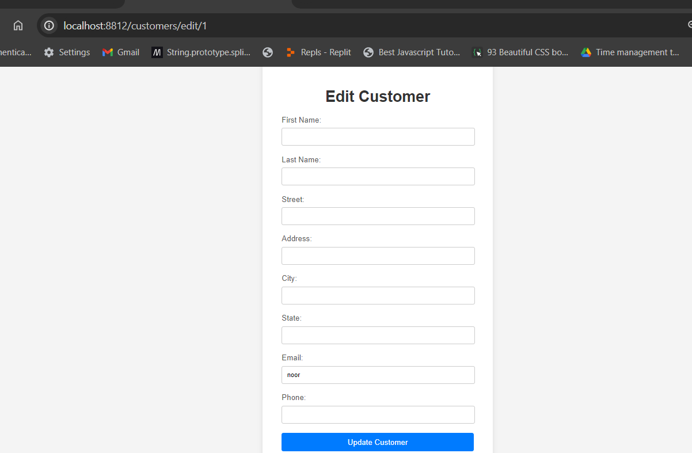
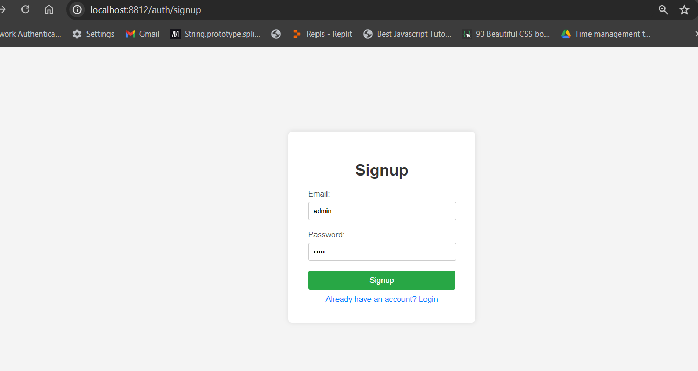

<!DOCTYPE html>
<html>

    

<body>
    <h1>Customer Management Application</h1>
    
This is a simple CRUD application for managing customers. The application is built using MySQL for the database, Spring Boot for the backend, and HTML/CSS/JavaScript for the frontend. It also includes JWT authentication and a sync feature to fetch customer data from an external API.

    <h2>Features</h2>
    <ul>
        <li>View a list of customers</li>
        <li>Add a new customer</li>
        <li>Edit an existing customer</li>
        <li>Delete a customer</li>
        <li>Search customers by different fields</li>
        <li>Sync customer data from an external API</li>
    </ul>
    <h2>Technologies Used</h2>
    <ul>
        <li>MySQL</li>
        <li>Spring Boot</li>
        <li>Thymeleaf</li>
        <li>HTML/CSS/JavaScript</li>
        <li>JWT Authentication</li>
    </ul>
    <h2>Getting Started</h2>
    
Follow these instructions to set up and run the project on your local machine.

    <h3>Prerequisites</h3>
    <ul>
        <li>Java 11 or higher</li>
        <li>MySQL</li>
        <li>Maven</li>
    </ul>
    <h3>Installation</h3>
    <ol>
        <li>Clone the repository:</li>
        <pre><code>git clone https://github.com/yourusername/customer-management.git</code></pre>
        <li>Navigate to the project directory:</li>
        <pre><code>cd customer-management</code></pre>
        <li>Create a MySQL database:</li>
        <pre><code>CREATE DATABASE customerdb;</code></pre>
        <li>Update the <code>application.properties</code> file with your MySQL database credentials:</li>
        <pre><code>
spring.datasource.url=jdbc:mysql://localhost:3306/customerdb
spring.datasource.username=yourusername
spring.datasource.password=yourpassword
        </code></pre>
        <li>Build the project using Maven:</li>
        <pre><code>mvn clean install</code></pre>
        <li>Run the application:</li>
        <pre><code>mvn spring-boot:run</code></pre>
    </ol>
    <h2>Usage</h2>
    
Once the application is running, you can access it at <code>http://localhost:8812</code>.

    
Login with your credentials or sign up to create a new account. Use the navigation menu to access different features of the application.

    <h2>Endpoints</h2>
    <ul>
        <li><code>/customers</code> - View the list of customers</li>
        <li><code>/customers/new</code> - Add a new customer</li>
        <li><code>/customers/edit/{id}</code> - Edit a customer</li>
        <li><code>/customers/delete/{id}</code> - Delete a customer</li>
        <li><code>/api/customers/sync</code> - Sync customer data from an external API</li>
    </ul>
    <h2>Screenshots</h2>
    
Below are some screenshots of the application:

    <h3>Customer List</h3>
    
    <h3>Add Customer</h3>
    
    <h3>Edit Customer</h3>
    
    <h3>Login</h3>
    
    <h3>Signup</h3>
    
    <h2>Contact</h2>
    
If you have any questions or suggestions, feel free to contact me at <a href="mailto:mdnoorishnauman@gmail.com">your-email@example.com</a>.

</body>
</html>
